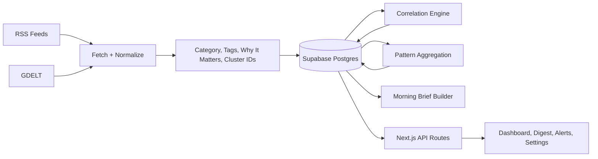

# GeoPulse Architecture

## Overview

GeoPulse is a Next.js + Supabase intelligence product for finance-focused users. It ingests geopolitical coverage, enriches and clusters it, maps stories to affected assets, and serves the result through a dashboard, morning brief, watchlists, alerts, and API routes.

Current production stack:

- Next.js 16 Pages Router
- React 18 + TypeScript
- Prisma ORM
- Supabase PostgreSQL
- Supabase Auth with Prisma-backed product profiles
- SWR on the client
- Vercel for deployment and scheduled cron triggering

## System Flow

## Major Subsystems

### Application Layer

- Pages Router app with authenticated product pages plus a public acquisition/preview surface on the homepage.
- Dashboard now uses server-side event filtering instead of loading a fixed client-side event window and filtering everything locally.
- Settings owns user preferences, digest schedule, delivery settings, and billing/access state.
- Digest is positioned as the daily habit loop rather than a side page.
- The public preview is intentionally snapshot-backed and lightweight so anonymous traffic does not depend on the full personalized data path.

### Data Pipeline

- Sources: configured RSS feeds plus GDELT.
- Ingestion stages: fetch, normalize, persist, correlate, pattern aggregation, sentiment, digest prep.
- Each ingestion run records both a high-level `IngestionLog` and a staged `IngestionJob`.
- Source fetches now populate `SourceHealth` records so failures and degraded feeds are visible.
- Events are enriched with:
  - `category`
  - `tags`
  - `whyThisMatters`
  - `duplicateClusterId`
  - `supportingSourcesCount`
  - `sourceReliability`
  - `relevanceScore`
  - `isPremiumInsight`

### Market Data

- Market quotes now flow through a provider abstraction in `src/lib/market.ts`.
- Preferred path: licensed/provider-backed API when configured via environment variables.
- Persistent fallback: latest `MarketSnapshot` rows from Postgres.
- Client surfaces now expose freshness explicitly as `live`, `delayed`, or `snapshot`.

### User State and Monetization Foundations

- `UserPreference` stores interests plus timezone and digest settings.
- `SavedFilter` persists reusable dashboard views.
- `DigestSubscription` stores morning-brief delivery settings.
- `Subscription` and `Entitlement` provide billing and feature-gating scaffolding.
- Product access is now structured as anonymous preview -> free account -> premium subscription.
- Scheduled digest processing is available through `/api/cron/digests` with per-user timezone matching and per-day deduplication.
- Stripe routes are implemented behind env gating:
  - checkout
  - billing portal
  - webhook processing

## Reliability Notes

The current architecture is suitable for early-stage growth, but it is intentionally still a staged hardening path rather than a finished scale architecture.

What is already improved:

- additive schema for product features and ops metadata
- staged ingestion job records
- source health tracking
- persistent market snapshot fallback
- Postgres-backed shared rate limiting for public preview APIs
- server-side event query contract
- billing + entitlements scaffolding
- a public preview path that shows real product value without requiring auth first
- normalized `/api/status` output so stale job rows do not contradict newer completed ingestions

What still remains for a later scale pass:

- true queue-backed workers rather than request-driven ingestion execution
- dedicated email delivery provider integration
- richer provider-backed market data
- stronger observability
- full-text search optimization in Postgres

## Key API Contracts

Important current routes:

- `GET /api/events`
  - supports `q`, `regions`, `categories`, `symbols`, `direction`, `severityMin`, `from`, `to`, `timeWindow`, `sort`, `cursor`, `limit`
- `GET /api/events/[id]`
  - returns trust metadata and related coverage
- `GET /api/me/entitlements`
  - returns plan state, feature flags, and limits
- `POST /api/saved-filters`
  - persists reusable dashboard views
- `POST /api/digests/send`
  - creates a digest preview/delivery record
- `POST /api/cron/digests`
  - processes morning briefs due in the current hour
- `POST /api/billing/checkout`
- `POST /api/billing/portal`
- `POST /api/webhooks/stripe`

## Deployment Assumptions

- Vercel handles web runtime and scheduled trigger entrypoints.
- Supabase is the system of record.
- `DATABASE_URL` should use the pooled connection string.
- `DIRECT_URL` should use the direct/session connection string for migrations.
- `ADMIN_EMAILS` should be set in production for admin-only routes such as `/api/sync`.
- Billing and provider-backed market data remain disabled unless the relevant env vars are configured.
